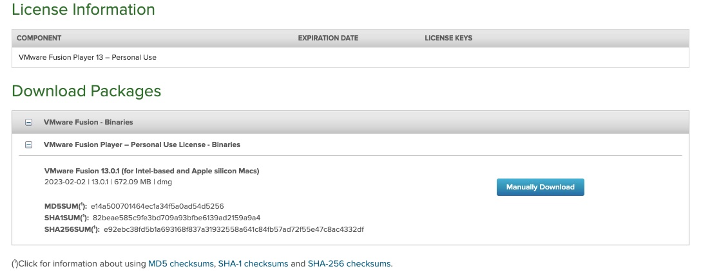
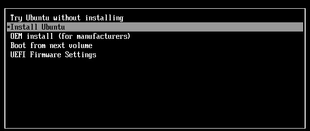
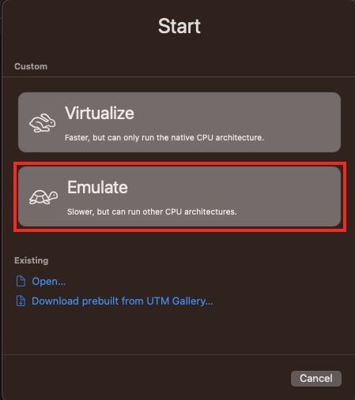
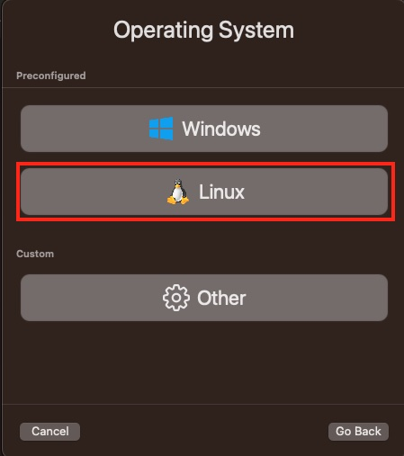
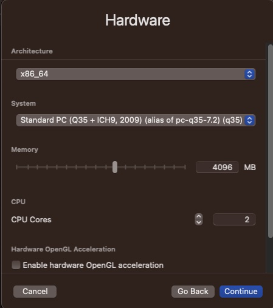

[](https://classroom.github.com/a/uJtaT5hO)
Compsci 677: Distributed and Operating Systems

Spring 2022

# Lablet 4: Hardware Virtualization

The purpose of this lablet is to provide hands-on experience with hardware virtualization and emulation.

## Part 1: Hardware Virtualization
In part we will be exploring virtualization using Type 2 hypervisors, which uses binary translation or hardware assisted virtualization. 


### Installing a Type-2 Hypervisor

The choice of type-2 hypervisor is dependent on the CPU on your machine. For Intel/AMD based CPUs, we will be using VirtualBox. However, for Apple silicon computers the current  version for virtual box does not work. Instead, we will be using VMware Fusion Player.  Thus, if you have Intel/AMD processor on your desktop/laptop with Windows/MacOS/Linux, use virtualbox. If you have Apple Silicon, use VMware Fusion Player. VMWare Player (The cross platform name for VMWare Fusion) also works for Intel Macs and a version is also available for Windows/Linux as a alternative to virtualbox. In your submission, Please state your host OS and the hypervisor you used.


### Installing Hypervisor
The installation is dependent on the CPU used for Intel/AMD (x86/AMD64) based CPUs we will be using VirtualBox. However, for Apple silicon computers the current develop version for virtual box is not properly functional. Instead, we will be using VMware Fusion Player (VMware Workstation/Fusion Player should work for all machines).

#### VirtualBox Installation.
You can download VirtualBox for your platform [here](https://www.virtualbox.org/wiki/Downloads).

> Note for Mac with Intel processors: After installation you might get an error saying "The
> Installation Failed". This is due to the installer was blocked by the Mac OS X "Security &
> Privacy" settings. You can follow the steps described
> [here](https://medium.com/@DMeechan/fixing-the-installation-failed-virtualbox-error-on-mac-high-sierra-7c421362b5b5)
> to resolve this issue.

#### VMWare Fusion/Workstation
The VMWare Fusion and workstation players are the same but the fusion is brand name for mac based machines. 

> The VMWare Workstation is available for both windows and linux [here](https://customerconnect.vmware.com/en/downloads/details?downloadGroup=WKST-PLAYER-1701&productId=1377).

> The VMWare Function player is available [here](https://customerconnect.vmware.com/evalcenter?p=fusion-player-personal-13). You either choose to download the free trial. Or create a free account and get a student license.




---
### Installing an OS on a new VM
> Intel/AMD (x86/AMD64) Based CPUs

We will use an `.iso` image to install an operating system onto a _virtual disk_, just as you would
install an OS onto an actual physical hard disk. We will use Ubuntu as the operating system
(although you can install any OS of your choice). You can download the image of Ubuntu 22.04 here:

* desktop image: https://releases.ubuntu.com/22.04.2/ubuntu-22.04.2-desktop-amd64.iso
* server image: https://releases.ubuntu.com/22.04.2/ubuntu-22.04.2-live-server-amd64.iso

Create a new VM by clicking on the "New" button. Give your VM a name, for example "ubuntu-vm". You
can change the local of VM if you want. In the "type" dropdown menu select "Linux", and in the
"Version" dropdown menu select "Ubuntu (64-bit)".
> Apple Silicon CPUs

Apple silicon uses [arm CPU architecture](https://en.wikipedia.org/wiki/ARM_architecture_family). For this reason, whatever OS you install it must be arm compatible. You can download the image of Ubuntu 20.04 here:

* desktop image: https://cdimage.ubuntu.com/focal/daily-live/pending/focal-desktop-arm64.iso

Other versions may have the server image for arm.

Create a new VM by clicking on the "New/+" sign. Give your VM a name, for example "ubutnu-vm". You can choose the iso image first and use the recommended configuration, or use configure the VM and then select the VM iso from the settings by loading it CD/DVD and connecting the virtual CD room. 

#### Memory:

The next step is to allocate hardware resources for your VM. VirtualBox will ask the amount of
memory to be allocated to the virtual machine. The memory here depends on which image you choose: if
you are installing the desktop image we recommend allocating at least 2GB since it will run a
desktop environment (GNOME) which can use a fair amount of memory. It also depends on how much
physical RAM is available on your host machine since the memory allocated to the VM cannot be used
by other programs. If you system is memory constrained, consider using the server image which should
be able to run with 1GB of memory.

#### Disk:
A virtual machine needs a virtual disk, and you can use a file as a virtual hard drive.  Virtual box and VMware adopt different disk formats, you can check the differences [here](https://www.educative.io/answers/vdi-vs-vhd-vs-vmdk). In both cases, you will be asked to either create a new virtual hard disk file or use an existing
create/provide virtual disk file. Here we will select "Create a new virtual hard disk now". 

> Virtual box
Choose the default VDI format for our virtual hard disk file, then select "dynamically allocated". Finally pick a location
for the virtual hard disk file and specify the disk size. 20GB should suffice.


> VMware Fusion/Workstation
VMware uses a default format for file systems called VMDK. 
We note that VMware uses a bundle format which contains all the files, so open the bundle `right-click -> Show package Contents` to see the vmdk files.

Q: After creating the virtual hard disk file, note the location of the file that you have created. Say
you created the virtual disk in /home/user/VMs/ubuntu-vm/vdisk1.vdi What is the size of virtual disk file vdisk1.vdi?. For VMware VMs the extension is .vmdk.


#### Mount the ISO:

So far, we’ve allocated storage and memory and thus created a “blank” virtual machine. Now select
the newly created VM on the left side panel, then click the "Start" button. You can either preselect the iso or VirtualBox will ask you
to select a virtual optical disk file as the installation media. Select the ISO file we downloaded
earlier (choose a virtual optical disk file -- Add -- pick the ISO file -- Open -- Choose -- Start). For VMware fusion/workstation the options is under settings and you need to make sure that the virtual device is connected.

#### Install The OS (Ubuntu):

The Ubuntu installer screen should appear since the VM boots from the CD-Drive first. Install Ubuntu
as you generally would. You can also refer to this [installation
guide](https://ubuntu.com/tutorials/install-ubuntu-desktop-1804#1-overview) if necessary.



You can try ubuntu if you want.

---
### Post Install

Once the OS is installed, Shut Down the VM or Reboot it. If the installer screen pops up again, the
VM is still booting from the CD and not from the hard-disk. Remove the CD-Drive from the settings if
the OS was installed successfully. This should now cause the hypervisor to pick the hard-disk to
boot from instead of the CD.

Try logging in and running your favorite programs. Try Pausing/UnPausing your VM. What is the
difference between power-cycling the VM and pausing/resuming?

> Note: If you change the VM settings, you will need to restart the VM to apply the changes.

#### Network Access

So far, we have not configured any network interface for the VM. If you need network access for your
VM, ensure that the Network Adapter is enabled in the VM settings. It can be of a NAT or a Bridged
type. Try both and report which works on your system.

Look up the IP address of your host system and the IP address of the VM. What are the IPs?

#### CPU

Change the processor configuration in the System tab. You can change the number of CPUs exposed to
the VM, and also enable/disable hardware virtualization acceleration if your CPU provides it
(VT-x/SVM). Look carefully through the configuration options for your virtual machine, especially
memory options, CPU options, networking and peripherals.

Write down your observations about configuration options as well as virtual disks.

### Part 1: Questions:
* What was your host operating system, guest operating system and the hypervisor you used?
* What is the size of the virtual disk on the host? Run `df` in the VM and report the size of the
  file-system that the VM sees.
* How long (approximately) does it take to pause and unpause a running VM?
* Which networking option (NAT/Bridged) worked for you? What are the IP addresses of your host and
  your VM?
* How much RAM and disk space did you allocate to the VM?
* What configuration options did you examine for the VM?
* Explain your understanding of dual-boot machines and how it differs from type-2 virtualization you used in this lablet.
  

## Part 2: Commandline VM Manager 
In this section we will take a quick look on another Virtualization framework and command line tool called [Ubuntu Multipass](https://multipass.run/). Multipass provides a simple command line interface that allows the creation/deletion of VMs. The command line interface is vital for automation, which is the defacto method for deploying application. [Learn more about devops](https://aws.amazon.com/devops/what-is-devops/).

### Installation 
Multipass is available on all OSs but the installations are different.
#### [Linux Instructions](https://multipass.run/docs/installing-on-linux)
The installation uses snap package manager you can install using `sudo apt install snapd`.
#### [MacOS Instructions](https://multipass.run/docs/installing-on-macos)
The installation is same on Intel/M1 based machines. You can use brew or installer.
#### [Windows Instructions](https://multipass.run/docs/installing-on-windows)
The windows installation can use hyperV or Virtual box as a backend. Check instructions more details.

After installation verify that it works by issuing the following command. 
```sh
multipass version
```
What is the output of this command?

### Launching Images
Multipass follows a docker like API (but uses VMs of course).

To run a VM, you first need to know what are available images. To list the available image:

```sh
multipass find

Image                       Aliases           Version          Description
18.04                       bionic            20230322         Ubuntu 18.04 LTS
...
```
To start an image use the following command:

```sh
multipass launch focal --name first-vm
```
This command runs a VM based on focal image (Ubuntu 20.04 LTS) and the VM is named `first-vm`.
To list the available containers.
```sh
multipass ls

Name                    State             IPv4             Image
first-vm                Running           192.168.64.4     Ubuntu 20.04 LTS
```
To use the VM shell
```sh
multipass shell first-vm
...
```
What is the output of `lscpu`?

Similar to all VMs you can suspend/stop the VM.

```sh
multipass stop first-vm
multipass ls
Name                    State             IPv4             Image
first-vm                Stopped           --               Ubuntu 20.04 LTS
```
You can start the VM again using
```
multipass start first-vm

multipass ls
Name                    State             IPv4             Image
three-cores             Running           192.168.64.5     Ubuntu 20.04 LTS
```

As mentioned earlier, any virtualization framework have the ability to set the number of core, memory size, etc. multipass allow such configuration when start by using the input arguments such as `cpus` `memory`, etc.

```sh
multipass launch focal --name three-cores --cpus 3
```
You can also change the number of core or memory, but of course the VM must be stopped.

```sh
multipass set local.first-vm.cpus=5
```
To delete the VM:
```sh
multipass delete first-vm
```
Note that the VM files are not actually deleted unless you use `multipass purge`.

### Launching Custom Images
Multipass provides many images with preinstalled applications. We will do a quick test with a docker based machine.

```sh
multipass launch docker --name docker-vm

multipass ls
Name                    State             IPv4             Image
docker-vm               Running           192.168.64.6     Ubuntu 22.04 LTS
                                          172.17.0.1
multipass exec docker-vm docker ps
CONTAINER ID   IMAGE                    COMMAND        CREATED         STATUS         PORTS                                                           NAMES
13f9c02c1dc5   portainer/portainer-ce   "/portainer"   2 minutes ago   Up 2 minutes   8000/tcp, 9443/tcp, 0.0.0.0:9000->9000/tcp, :::9000->9000/tcp   portainer
```
portainer is a web interface for managing docker containers.

### Part 2 Questions:
* Please state your host OS and the configuration you used if applicable.
* What is the output of the `multipass version` command?
* What is the output of `lscpu`?
* Did you face any challenges to run multipass?

## Part 3: Emulation
Emulation is the process of imitating another device to allow running software that are not compatible with the current hardware/software APIs. Examples of Emulators are available [here](https://en.wikipedia.org/wiki/Emulator). In this part we will be using QEMU. 

[QEMU](https://www.qemu.org/) can emulates the machine's processor through dynamic binary translation and provides a set of different hardware and device models for the machine, enabling it to run a variety of guest operating systems.

> For this part, Its recommended to use the OS Try option instead of installation.

### Linux Machines
For linux machines, there are 100s of resources on how to use QEMU. We have listed these are examples:
* https://www.tecmint.com/install-qemu-kvm-ubuntu-create-virtual-machines/
* https://www.how2shout.com/linux/how-to-install-qemu-kvm-and-virt-manager-gui-on-ubuntu-20-04-lts/

#### Testing other Architectures.
The advantage of emulation is that you can run completely different architecture. Till this point we have been emulating the same architecture, however QEMU comes with multiple machines out of the box Examples: `qemu-system-arm` `qemu-system-aarch64` for arm processors, and `qemu-system-ppc` for IBM power pc. However, testing other method requires slightly different configuration.

### Windows Machines
Similar to linux we will use the QEMU:
#### Installation
Install QEMU itself from [here](https://www.qemu.org/download/#windows), download the latest version directly using this [link](https://qemu.weilnetz.de/w64/2022/qemu-w64-setup-20221230.exe).

> Note: QEMU can be running with KVM hypervisor (Virtualization), in this lablet run it without KVM to see how emulation works.

#### Running a guest OS
In this case we will be using the AMD64 based ubuntu images. You can download the image of Ubuntu 22.04 here:

* desktop image: https://releases.ubuntu.com/22.04.2/ubuntu-22.04.2-desktop-amd64.iso
* server image: https://releases.ubuntu.com/22.04.2/ubuntu-22.04.2-live-server-amd64.iso

Its recommended that you use absolute directories to avoid mistakes. In the following commands, we assume that the use is the drive `D:\`. You can go to drive `D:\` using `cd D:\` or just `D:`. You can move the ubuntu iso to this directory.

**Steps**:
1. Open PowerShell
2. Verify you can access the qemu binaries 
  ```
  PS D:\> qemu-system-x86_64 -version
  QEMU emulator version 7.2.0 (v7.2.0-11948-ge6523b71fc-dirty)
  Copyright (c) 2003-2022 Fabrice Bellard and the QEMU Project developers
  ```
In case the qemu binaries were not visible, you can add the installation location to the PATH environment variable, instructions are [here](https://helpdeskgeek.com/windows-10/add-windows-path-environment-variable/).

3. Similar to VMs you have to create a disk. QEMU uses the qcow2 format by default but you can select which format to use using the `-f` option.
```
PS D:\> qemu-img create -f qcow2 ubuntu22.img 30G
```
4. Start a new emulated machine
```
PS D:\> qemu-system-x86_64 -m 1G -smp 2 -boot order=c,once=d -hda ubuntu22.img  -net nic,model=virtio -net user -vga std -drive file="ubuntu-22.04.2-live-server-amd64.iso",media=cdrom
```
Note that similar to Virtualbox/Fusion, I am configuring the memory `-m 1G`, CPUs `-smp 2`, hard disk file `-hda ubuntu22.img` and adding a drive to boot from `-drive file="ubuntu-22.04.2-live-server-amd64.iso",media=cdrom`
> Note: in many tutorial they use the command option `cdrom="iso for the OS"`, However, our experiments ony using the drive file worked.
5. After installation run the same command without booting from the installation image.
```
PS D:\> qemu-system-x86_64 -m 1G -smp 2 -hda ubuntu22.img  -net nic,model=virtio -net user -vga std
```

**Testing with another CPUs models**
By default QEMU uses QEMU CPU, but it can also emulate other CPUs. To list available CPUs models. The machine name is machine name without x86.

```
PS D:\> qemu-system-x86_64 -cpu help
Available CPUs:
x86 486                   (alias configured by machine type)
x86 486-v1
x86 Broadwell             (alias configured by machine type)
x86 Broadwell-IBRS        (alias of Broadwell-v3)
x86 Broadwell-noTSX       (alias of Broadwell-v2)
x86 Broadwell-noTSX-IBRS  (alias of Broadwell-v4)
....

```
To run a machine with a different cpu use the `-cpu` options when running the guest os.

> Note: QEMU can be running with Hyper-V hypervisor (Virtualization), in this lablet run it without Hyper-V acceleration to see how emulation works.

#### Testing other Architectures.
The advantage of emulation is that you can run completely different architecture. Till this point we have been emulating the same architecture, however QEMU comes with multiple machines out of the box Examples: `qemu-system-arm` `qemu-system-aarch64` for arm processors, and `qemu-system-ppc` for IBM power pc. However, testing other method requires slightly different configuration.


### Apple Machines Intel/Apple Silicon
For apple computers we will be using UTM. UTM is available to download directly or through the app store from [here](https://mac.getutm.app/).

#### Running a guest OS
In this case we will be using the AMD64 based ubuntu images. You can download the image of Ubuntu 22.04 here:

* desktop image: https://releases.ubuntu.com/22.04.2/ubuntu-22.04.2-desktop-amd64.iso
* server image: https://releases.ubuntu.com/22.04.2/ubuntu-22.04.2-live-server-amd64.iso

**Steps**:
1. After installation open UTM
2. Click on the "+" Sign or File > New.
3. Select Emulate (the Virtualize option is under development and only will work if you run arm based images  - Similar to what we did in Part 1)



4. Select OS



5. Select ISO image to book from (Make sure that you're using an AMD64 image)

6. Configure hardware. Configure the emulated hardware. This is similar to what we discussed earlier except you get to choose which CPU you are about to emulate. You should select the cpu that is compatible with the OS you download.



7. Specify the disk storage

8. Start the VM and Install the OS as in Installation instructions from part one [link](#install-the-os-ubuntu).

#### Ready Image from the gallery
You can also visit the [gallery](https://mac.getutm.app/gallery/) and test different ready images.
### Part 3: Questions
  * Do you notice how slow the emulated vs Virtualization? Why do you think this is the case?
  * Can describe the output of the following command in both virtualization and emulation `lscpu`? Please test different CPUs and report the differences when using the `lscpu` command?
  * QEMU uses the qcow2 file format. You can locate the disk using `View in finder > Open Package Contents > Data > *.qcow2` or the location of your stored VM files. Please report the file size? Do you think it different from the vmdk/vdi files in virtualization.
  * Discuss your CPU utilization under virtualization and emulation. You can use task manager/Activity monitor or similar tools. Which method requires host CPU usage?

## What to submit

Please fill in the [report](./report/README.md)  with your observations and output (text of screen shots) from the key steps in
this assignment. Please include the following information. Answer all the questions listed in the description of the steps.
* **Part 1:**
  * What was your host operating system, guest operating system and the hypervisor you used?
  * What is the size of the virtual disk on the host? Run `df` in the VM and report the size of the
    file-system that the VM sees.
  * How long (approximately) does it take to pause and unpause a running VM?
  * Which networking option (NAT/Bridged) worked for you? What are the IP addresses of your host and
    your VM?
  * How much RAM and disk space did you allocate to the VM?
  * What configuration options did you examine for the VM?
  * Explain your understanding of dual-boot machines and how it differs from type-2 virtualization you used in this lablet.
  

* **Part 2:**
  * Please state your host OS and the configuration you used if applicable.
  * What is the output of the `multipass version` command?
  * What is the output of `lscpu`?
  * Did you face any challenges to run multipass?


* **Part 3:**
  * Do you notice how slow the emulated vs Virtualization? Why do you think this is the case?
  * Can describe the output of the following command in both virtualization and emulation `lscpu`? Please test different CPUs and report the differences when using the `lscpu` command?
  * QEMU uses the qcow2 file format. You can locate the disk using `View in finder > Open Package Contents > Data > *.qcow2` or the location of your stored VM files. Please report the file size? Do you think it different from the vmdk/vdi files in virtualization.
  * Discuss your CPU utilization under virtualization and emulation. You can use task manager/Activity monitor or similar tools. Which method requires host CPU usage?